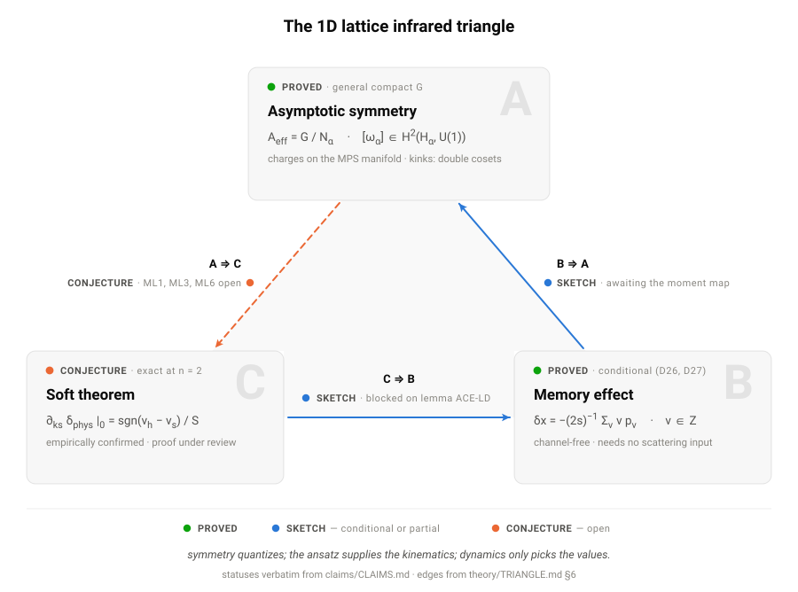
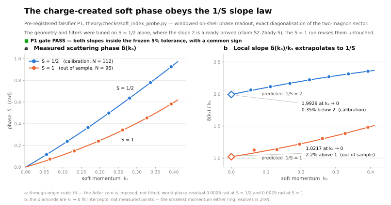
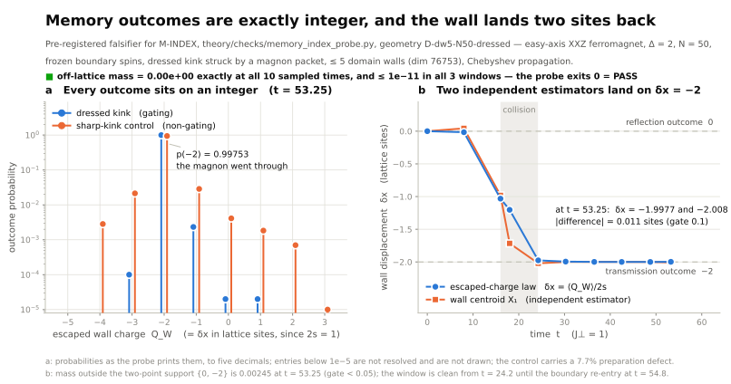
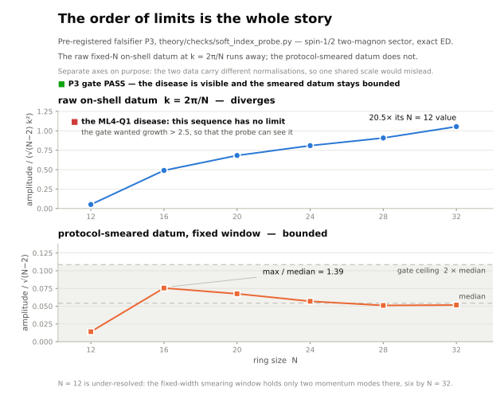
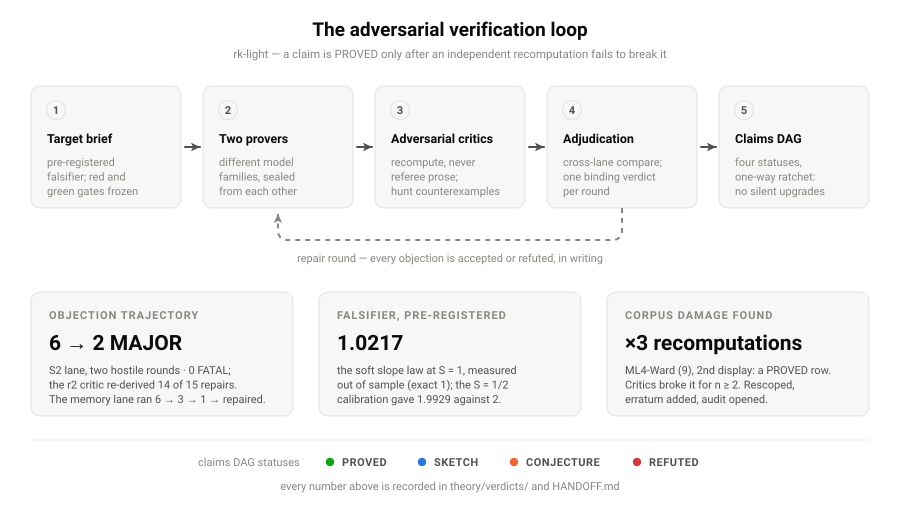

# An infrared triangle for quantum spin chains

In gauge theory and gravity, three apparently unrelated facts turn out to be one fact wearing three hats. **Soft theorems**: amplitudes factorise when one quantum's frequency goes to zero. **Asymptotic symmetries**: transformations acting nontrivially at infinity, modulo those that die off. **Memory effects**: the permanent shift radiation leaves behind. Strominger's *infrared triangle* is the observation that each corner implies the others through a single Ward identity.

This repository asks whether the same triangle exists on a one-dimensional quantum spin chain — where there is no gauge mediator, no boost, no null infinity, and where the natural soft statement is an Adler zero rather than a Weinberg pole. It seems to, and in matrix-product-state (MPS) language each corner becomes a finite, checkable statement about tensors: a symmetry applied to a finite region acts only through two operators on the virtual bonds at its edges, and the rest follows from that. Some of the triangle is proved. One corner is not, and one of its lanes is currently failing adversarial review. This README says which is which, because that distinction is the point of the project.

<picture>
  <source media="(prefers-color-scheme: dark)" srcset="docs/assets/triangle-dark.svg">
  
</picture>

Status words are taken verbatim from [`claims/CLAIMS.md`](claims/CLAIMS.md), the single source of truth for what is established:

-1f6feb)


## The three corners

### A — asymptotic symmetry &nbsp; 

Apply an on-site symmetry to a finite interval of an injective MPS. The virtual matrices telescope and cancel in the bulk, leaving exactly two insertions on the boundary bonds (`WI`, exact at finite volume). From that identity: the endpoint space is a $PGL(\chi)$-torsor with unbroken orbit $G/N_\alpha$ (`A1`); a *half-infinite* string converges only weak-$*$ and lands in a sector disjoint from the vacuum folium — a kink is the contact term of a broken truncated symmetry — with the diagonal invariant of a vacuum pair a double coset in $H_\alpha \backslash G / H_\alpha$ (`A2`); and lattice Noether and the continuity equation hold exactly (`G0`).

A by-product of the memory work belongs here: for a $U(1)$-covariant injective MPS vacuum *pair* with antisymmetric tail densities $\pm\rho$, integrality of the window spectra forces $2\rho \in \mathbb{Z}$ (`M-IDX-density`) — a Lieb–Schultz–Mattis-flavoured density quantization. The antisymmetry is load-bearing; one tail alone gives only $\rho \in \kappa + \mathbb{Z}$.

Two caveats. The naive asymptotic symmetry group $\mathcal{A} = (G_L\times G_R)/G_{\rm diag}$ of our own brief is **not** the classifying object (`A2-orbit-r1`, ). And two load-bearing side hypotheses — the split property, and uniformity over a continuous vacuum manifold — remain at  and are flagged wherever they are used.

### B — memory &nbsp; -1f6feb)

A magnon passes through a domain wall and leaves it permanently displaced by $\delta x$. The result we are most confident of is that this quantization needs no scattering theory at all. Under an integrality hypothesis alone — no dynamical input — the escaped-charge increment of a finite window in an explicit two-projective-measurement protocol is integer-valued (`M-INDEX-fin`, ); add a Lieb–Robinson-type tightness hypothesis and every subsequential outcome law is supported on $\mathbb{Z}$ with

$$\delta x \;=\; -\frac{1}{2s}\sum_\nu \nu\, p_\nu ,$$

with **no channel inventory, no completeness, and bound states allowed** (`M-INDEX-spec`). Superselection quantizes; dynamics only picks the values. What this does *not* say: $\delta x$ is an average over a quantized law and is never claimed quantized itself; the tightness hypothesis is assumed, not derived; and an unconditional sector-wide charge operator does **not** exist (`M-INDEX-LA-strong`, , by two independent mechanisms).

### C — soft theorem &nbsp; 

The sharp proved statement is two-body. For the isotropic spin-$S$ ferromagnet, with a hard magnon at fixed $0<|k_h|<\pi$ and soft momentum $k_s\to 0$,

$$\left.\frac{\partial \delta_{\rm phys}}{\partial k_s}\right|_{0} = \frac{\mathrm{sgn}(v_h-v_s)}{S}$$

exactly, for every site spin, from the two-magnon contact algebra and *without* an integrability assumption (`S2-2body`, `S2-2body-S`, ; completeness comes from direct Jacobi diagonalisation, `ML2`). This is the unit-charge two-body slope only — the $|q_{\rm hard}|>1$ factor is untested and open. The general $n$-leg theorem is `S-general`, , and unrestricted source universality is false (`ML5`, ) — the counterexample deforms the source of the soft leg.

The current campaign ([`briefs/soft-index-target.md`](briefs/soft-index-target.md)) routes around that by making the soft leg protocol-explicit: the soft insertion *is* the smeared broken charge, so the law becomes a constraint on every limit point of a charge-created datum, and scattering theory is demoted to supplying existence and values. Where it stands, plainly: the unconditional finite-volume Ward package survives and was re-verified by both critics across deformations, but **both independent prover shards failed round-1 review with FATAL objections** and remain at , quarantined — nothing from the campaign has entered `CLAIMS.md`. The interesting part is the contrast: the *law* keeps surviving falsification (below) while the *proof* has not converged. Full adjudication: [`theory/verdicts/soft-index-adjudication-r1.md`](theory/verdicts/soft-index-adjudication-r1.md).

**Edges.** $A\Rightarrow C$  &nbsp; $C\Rightarrow B$  &nbsp; $B\Rightarrow A$ 

## Falsify first

Before a proof lands we freeze a numerical probe, with pass/fail criteria written into the campaign brief, and run it. A probe that cannot fail is not evidence, so each ships a `--red` mode that mutates the prediction and must exit non-zero. Twice now a probe has passed *before* the corresponding proof existed — the only order in which passing means much.

<picture>
  <source media="(prefers-color-scheme: dark)" srcset="docs/assets/soft-slope-dark.svg">
  
</picture>

The slope law, measured on a charge-created soft packet by exact diagonalisation: **1.9929** at $S=1/2$ against a predicted 2 (0.35%), and **1.0217** at $S=1$ against a predicted 1 (2.2%). Geometry and filter parameters were tuned on $S=1/2$ only, where the answer is already proved — the $S=1$ point is out-of-sample. Adler residuals stay below 0.003. The frozen protocol-dodge test passed in its source register (P2(a)); its second half, P2(b), is **void** — the $\eta$ gate turned out to be a code no-op, found independently by both critics — and is not quoted here as evidence pending an honest re-run.

<picture>
  <source media="(prefers-color-scheme: dark)" srcset="docs/assets/memory-quantization-dark.svg">
  
</picture>

The memory probe looks for outcome weight *off* the integer lattice, which is what would falsify `M-INDEX`. It finds exactly zero off-lattice mass at $N=50$, and the near-threshold zero-velocity magnon pairs — the configurations most likely to smear the answer — land on integers.

<picture>
  <source media="(prefers-color-scheme: dark)" srcset="docs/assets/ml4q1-disease-dark.svg">
  
</picture>

A probe should be able to see the disease it is fenced against. Feed it the raw on-shell sequence $k_s = 2\pi/N$ at fixed volume and the known $\sqrt{N}$ pathology appears — growth factor **20.5** — while the packet-smeared datum the theorem is actually about stays bounded at **1.39**. The smearing and window discipline are load-bearing, not cosmetic.

## Adversarial verification

The workflow ([`CLAUDE.md`](CLAUDE.md), law L6) assumes we will be wrong and tries to find out cheaply. Proofs are drafted by independent provers from *different* model families, in isolated lanes on separate files. Critics are asked to recompute rather than referee: a critic who merely disagrees is not done. Every rigorous argument is written in Lamport's hierarchical style ($\langle 1\rangle 1$, $\langle 2\rangle 3$, …), each leaf justified by a numbered definition, a claim id, or a named computation. Claims move up the status ladder only when the loop reaches a fixed point — and the ladder ratchets down as readily as up.

<picture>
  <source media="(prefers-color-scheme: dark)" srcset="docs/assets/adversarial-loop-dark.svg">
  
</picture>

The best evidence that this works is that it hurts. This week a critic in one soft-theorem lane attacked a display in `ML4-Ward` — a row we had already marked **PROVED** — and was right: the second display of equation (9) holds at $n=1$ only and is false for $n\ge 2$. Three independent recomputations confirmed it (the critic's exact diagonalisation, an analytic mechanism, and a fresh red-capable checker, [`theory/checks/ml4_ward_n2_check.py`](theory/checks/ml4_ward_n2_check.py)); the claims row was scoped with an erratum, the corrected form $P_{n,N}J^-_0 = 2 D_{n,N} A_n^{-1} J^z_0$ was verified exact at every $n<N/2$, and an audit of every $n\ge2$ user downstream is now open. Two adjudicator errors have been caught the same way, by writing the failing check first.

## Repo map

| path | what lives there |
|---|---|
| [`claims/CLAIMS.md`](claims/CLAIMS.md) | the claims DAG: every claim, status, dependency, where proved, where tested |
| [`notation.md`](notation.md), [`definitions.md`](definitions.md) | single sources for every symbol and numbered definition; nothing is redefined elsewhere |
| [`theory/`](theory) | Lamport-structured proof shards, one lemma-cluster per file, plus [`theory/verdicts/`](theory/verdicts) — critic verdicts and adjudications, kept whether they passed or failed |
| [`theory/checks/`](theory/checks) | standalone red/green checkers and pre-registered falsifier probes (numpy/scipy only, no repo dependency) |
| [`numerics/`](numerics) | Julia (TensorKit) exact diagonalisation and wavepacket dynamics, with tests and frozen result records |
| [`briefs/`](briefs) | campaign work orders: targets, lane assignments, and falsifier criteria, written before the work |
| [`paper/`](paper) | a parked draft, not a preprint (see below) |
| [`docs/`](docs) | background framing, novelty sweep, prose guide |
| `refs/` | TeX sources of cited papers, used as ground truth for every quotation. Gitignored (not ours to redistribute); `refs/LEDGER.md` records what was fetched and verified |

## Reproducing

Checkers are plain Python 3 with numpy/scipy and need nothing from the repo:

```bash
python3 -O theory/checks/corner_a_check.py             # exit 0 = green
python3 -O theory/checks/ml4_ward_n2_check.py --red    # exit 1 = the mutant died
python3 -O theory/checks/soft_index_probe.py           # frozen soft-slope falsifier
python3 -O theory/checks/memory_index_probe.py         # frozen memory falsifier
```

Green is exit 0, and every claim of green here means an exit-0 run under `python3 -O`. Ten of the fifteen checkers accept an explicit mutation flag (`--red`, or a named variant such as `--red-p3` or `--red-uniform`) that must exit 1; the remaining five are green-only cross-checks against exact oracles. The two probes are the slow ones — exact diagonalisation with Chebyshev propagation.

For the Julia side (`Manifest.toml` is gitignored, so instantiate first):

```bash
cd numerics
julia --project=. -e 'using Pkg; Pkg.instantiate()'
julia --project=. test/runtests.jl
```

## Status and roadmap

Work in progress, and claims here can be — and are — refuted, including our own. Open fronts, in the order we intend to take them:

- **Downstream audit of the `ML4-Ward` erratum.** Every $n\ge2$ use of the refuted display needs re-checking; one two-hard-leg step is known to be damaged.
- **A vacuity question in the soft class.** Two frozen conditions together appear to force the repaired universality class to be empty for $\rho\ne 1/2$. That is vacuity, not falsity, but it blocks the campaign's definition merge until adjudicated once, in the definitions file.
- **Soft-theorem round 2.** One unified prover shard replacing the two failed lanes, with the slope value taken from proved on-shell data rather than stipulated; plus one remaining objection in the existence lane (a Haag–Ruelle creator-independence port), which is two hostile rounds from zero FATALs.
- **Unfreeze and re-run the probe's void $\eta$ gate**, then re-quote it honestly.
- **The first unconditional dynamical instance** of the memory theorem's tightness hypothesis — the largest remaining prize in corner B.
- **The paper is parked.** `paper/` holds a draft its author judged not good enough and stopped; passing a claim-licensing review is not the same as being worth reading. It is not a forthcoming preprint, and nothing from the recent campaigns is in it.

## License, citation, contact

Licensed under the **GNU Affero General Public License v3.0** — see [`LICENSE`](LICENSE).

There is no preprint to cite yet. To refer to something here, please cite the repository and the commit hash, and quote the claim's status from `claims/CLAIMS.md` rather than from this README, which can lag.

Author: Tobias J. Osborne (Leibniz Universität Hannover, Institute of Theoretical Physics). Corrections, counterexamples, and recomputations are the most welcome kind of issue — this project is built to be attacked.
